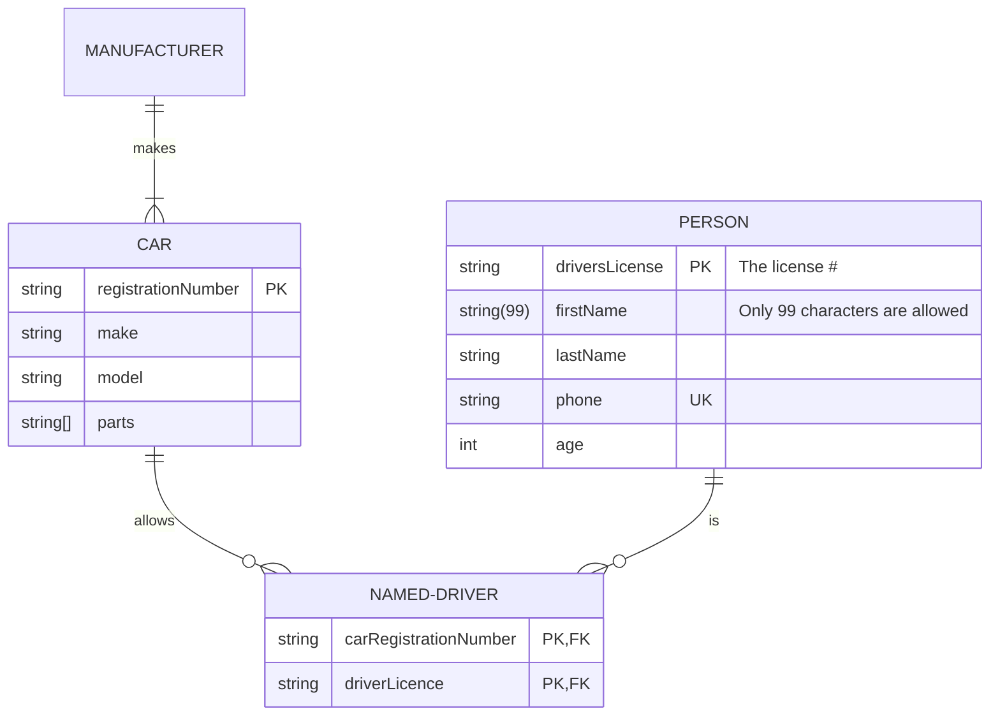

# Schema Design

When it comes to MongoDB database schema design, this is what most developers think of when they are looking at designing a relational schema and a MongoDB schema.

I have to admit that I understand the impulse to design your MongoDB schema the same way you have always designed your SQL schema. It's completely normal to want to split up your data into neat little tables as you've always done before. I was guilty of doing this when I first started learning how to use MongoDB. However, as we will soon see, you lose out on many of the awesome features of MongoDB when you design your schema like an SQL schema.

However, I think it's best to compare MongoDB schema design to relational schema design since that's where many devs coming to MongoDB are coming from. So, let's see how these two design patterns differ.

## Relational Schema Design

## Type of Relationships

Okay, so now that we have explored the two ways we are able to split up data when designing our schemas in MongoDB, let's look at common relationships that you're probably familiar with modeling if you come from an SQL background. We will start with the more simple relationships and work our way up to some interesting patterns and relationships and how we model them with real-world examples. Note, we are only going to scratch the surface of modeling relationships in MongoDB here.

It's also important to note that even if your application has the same exact data as the examples listed below, you might have a completely different schema than the one I outlined here. This is because the most important consideration you make for your schema is how your data is going to be used by your system. In each example, I will outline the requirements for each application and why a given schema was used for that example. If you want to discuss the specifics of your schema, be sure to open a conversation on the MongoDB Community Forum, and we all can discuss what will work best for your unique application.

### One to One

Let's take a look at our User document. This example has some great one-to-one data in it. For example, in our system, one user can only have one name. So, this would be an example of a one-to-one relationship. We can model all one-to-one data as key-value pairs in our database.

- Prefer key-value pair embedded in the document.
- For example, an employee can work in one and only one department.

```ts
{
  "_id": "ObjectId('xxx')",
  "name": "Joe Karlsson",
  "company": "MongoDB",
  "twitter": "@JoeKarlsson1",
  "twitch": "joe_karlsson",
  "tiktok": "joekarlsson",
  "website": "joekarlsson.com"
}
```

### One to Few

Okay, now let's say that we are dealing a small sequence of data that's associated with our users. For example, we might need to store several addresses associated with a given user. It's unlikely that a user for our application would have more than a couple of different addresses. For relationships like this, we would define this as a one-to-few relationship.

- Prefer embedding for one-to-few relationships.



```ts
{
  "_id": "ObjectId('AAA')",
  "name": "Joe Karlsson",
  "company": "MongoDB",
  "twitter": "@JoeKarlsson1",
  "twitch": "joe_karlsson",
  "tiktok": "joekarlsson",
  "website": "joekarlsson.com",
  "addresses": [
    { "street": "123 Sesame St", "city": "Anytown", "cc": "USA" },  
    { "street": "123 Avenue Q",  "city": "New York", "cc": "USA" }
  ]
}
```

Remember when I told you there are no rules to MongoDB schema design? Well, I lied. I've made up a couple of handy rules to help you design your schema for your application.

### One to Many

Alright, let's say that you are building a product page for an e-commerce website, and you are going to have to design a schema that will be able to show product information. In our system, we save information about all the many parts that make up each product for repair services. How would you design a schema to save all this data, but still make your product page performant? You might want to consider a one-to-many schema since your one product is made up of many parts.

Now, with a schema that could potentially be saving thousands of sub parts, we probably do not need to have all of the data for the parts on every single request, but it's still important that this relationship is maintained in our schema. So, we might have a Products collection with data about each product in our e-commerce store, and in order to keep that part data linked, we can keep an array of Object IDs that link to a document that has information about the part. These parts can be saved in the same collection or in a separate collection, if needed. Let's take a look at how this would look.

### Many to Many

### Summary