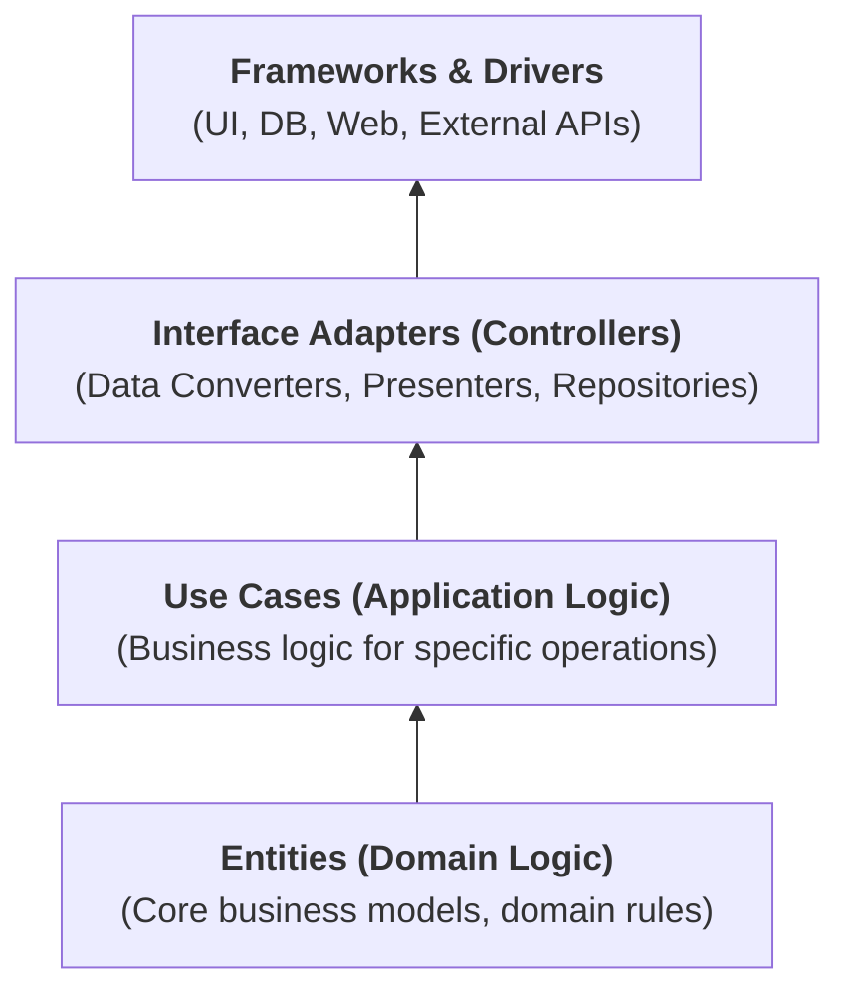

# Clean Architecture

Clean Architecture is a software design philosophy introduced by Robert C. Martin (also known as "Uncle Bob"). Its primary goal is to make systems more maintainable, testable, and independent of frameworks, UI, and external technologies. This approach emphasizes separation of concerns, dependency inversion, and a clear structure that allows for flexibility, scalability, and easy testing.

Clean Architecture is a high-level blueprint that outlines how software systems should be structured and how their components should interact, aiming for independence from frameworks, UI, and other external elements. It divides the system into concentric circles (layers), each with a well-defined responsibility, where the core business logic is at the center.

## Key Principles of Clean Architecture:

Separation of Concerns: The system is divided into layers or components that each focus on a specific responsibility. Each layer interacts with the layer directly beneath it, but not the other way around.

Dependency Inversion: The direction of dependencies should be towards the core of the system, which is agnostic to external concerns. This ensures that the core logic is not dependent on external frameworks or technologies.

Testability: The architecture facilitates easy unit testing by isolating dependencies and enabling mock or stub implementations.

Independence of Frameworks: The design is independent of specific frameworks, meaning you can swap frameworks with minimal impact on the business logic.

Flexibility: The architecture allows for easy changes to UI, databases, and frameworks without affecting core functionality.

## Layers of Clean Architecture

At the core of Clean Architecture is a layered structure that organizes the system into different levels of abstraction. Each layer is more abstract than the one below it and depends on lower layers, but never vice versa. Here's how the layers are typically structured (from innermost to outermost):

1. Entities (Core Business Logic)
What it is: This layer contains the core business logic and domain models. It defines the fundamental business rules of your system, independent of any external factors.
Purpose: It is the most abstract layer and should not depend on any other layers.
Examples: Core models, business rules, domain objects (e.g., a Customer or Order class in an e-commerce app).

2. Use Cases (Application Business Rules)
What it is: This layer contains the application logic that coordinates the flow of data between the entities and the external layers. It is responsible for orchestrating tasks that fulfill business requirements.
Purpose: This layer should handle business operations, such as creating an order, calculating a discount, etc.
Examples: Use case classes that implement the application's specific tasks, such as PlaceOrder, CalculateDiscount, etc.

3. Interface Adapters (Adapters and Controllers)
What it is: This layer contains adapters that convert data between the application layer and the external layers, such as the UI, database, or external services.
Purpose: The interface adapters transform data from a form that the core logic understands into a form that is suitable for interaction with the external systems (e.g., HTTP requests, database queries).
Examples: Controllers, presenters, view models, repositories, and database adapters that are used to present data to the user or save data to the database.

4. Frameworks and Drivers (External Interfaces)
What it is: This is the outermost layer, containing all the external technologies and frameworks, such as web frameworks, databases, UI, and external services.
Purpose: It should be independent of the inner layers but can interact with the inner layers through well-defined interfaces.
Examples: Web frameworks (like Express, Django), databases (like MySQL, MongoDB), external APIs, file systems, and user interfaces.

## Diagram of Clean Architecture

## Example: Online Shopping Application

In an online shopping application, here’s how Clean Architecture could be applied:

Entities:

- Product, Order, User, etc. These models represent the domain's core business rules, like how products are priced or how orders are processed.

Use Cases:

- PlaceOrder, CalculateDiscount, ProcessPayment. These use cases define the actions that interact with the business models and are triggered by external systems (UI, API calls, etc.).

Interface Adapters:

- Controllers: Handle HTTP requests (e.g., OrderController, ProductController).
- Repositories: Interface between use cases and data storage (e.g., ProductRepository or OrderRepository).
- Presenters/View Models: Format data for the user interface.

Frameworks & Drivers:

- Web framework (like Express, Django), Database (like PostgreSQL, MongoDB), external services (like Stripe for payment processing).

## Benefits of Clean Architecture:

Maintainability: The system is divided into smaller, more manageable parts, making it easier to change or update individual components without affecting the entire system.

Testability: The separation of concerns allows for easier unit and integration testing since the core business logic is decoupled from external dependencies.

Flexibility: It is easier to swap out technologies (e.g., change the database or UI framework) without affecting the core business logic.

Scalability: The design can scale as the system grows, with new features or changes implemented in a way that doesn’t disturb existing functionality.

Decoupling: Reduces tight coupling between components, allowing each part of the system to evolve independently.

## Conclusion:

Clean Architecture provides a blueprint for designing robust, maintainable, and scalable software systems. By ensuring a separation of concerns, applying dependency inversion, and keeping the business logic independent from frameworks and external systems, it helps developers build software that is easier to test, maintain, and extend over time.